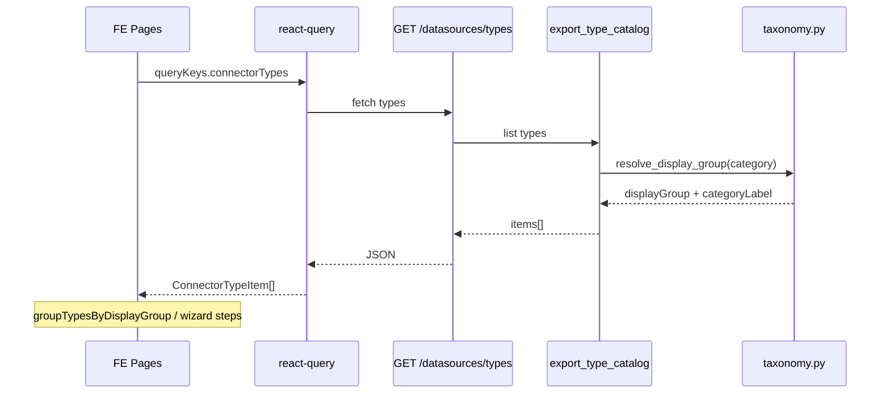

# Design Spec: M-PRODUCT · F-B — DS-007 DataEase 五类数据源展示 taxonomy

```yaml
date: 2026-07-08
round_target: docs/superpowers/evolution/2026-07-08-round-target-mproduct-fb.md
prd_ids: [DS-007]
phase: P1
ui_design_skill: .agents/skills/b-design-system-tailadmin-radix/SKILL.md
scope_file_count: 12
```

---

## 1. 批量主题与子项映射

| 子项 | PRD ID | 描述 |
|------|--------|------|
| 1 | DS-007 | 后端 types API 扩展 `displayGroup` + `categoryLabel` 展示 taxonomy |
| 2 | DS-007 | `ConnectorsPage` 按类分组 Tabs + 类型图标 |
| 3 | DS-007 | `DatasourceFormPage` 新建路径三步向导（大类卡片 → 具体类型 → 既有表单） |

**依赖链**：子项 1（API 契约）→ 子项 2 / 子项 3（FE 消费同一 taxonomy 模块）。

---

## 2. 上下文与问题陈述

### 2.1 当前痛点

- `GET /api/v1/datasources/types` 仅返回引擎内部 `category`（`relational`/`olap`/`lake`/`timeseries`/`search`/`document`/`embedded`/`file`/`api`），与 DataEase 面向用户的五类中文分组不对齐。
- `/admin/connectors` 将 30 种连接器平铺于单表，认知负担高，无法按「关系型 / OLAP / 数仓库湖 / 文件 / API / 更多」浏览。
- `/admin/datasources/new` 在单一下拉中列出全部类型，新建源路径噪音大，与 DataEase「先选大类再选引擎」向导差距明显。

### 2.2 目标

在**不修改方言 `category` 注册值、不改连接器执行链**的前提下：

1. 后端 catalog 导出增加 FE 展示层字段 `displayGroup` + `categoryLabel`。
2. 连接器目录页按展示分组渲染（含图标）。
3. 新建数据源页引入三步向导；编辑路径行为不变。

### 2.3 方案对比（P1 定案）

| 维度 | A：仅 FE 本地映射 | B：后端 API 扩展（推荐） | C：独立 taxonomy 端点 |
|------|-------------------|-------------------------|----------------------|
| 契约 | 无 API 变更 | 扩展现有 `/types` 字段 | 新路由 `/types/taxonomy` |
| 一致性 | FE/BE 易漂移 | 单一真理源在 `datasources/taxonomy.py` | 两次请求 |
| 性能 | 首屏无额外请求 | 同一次 types 请求附带元数据 | 多一次 RTT |
| 测试 | 仅 vitest | pytest + vitest 可断言契约 | 分散 |

**推荐 B**：与 round-target、plan F-B 原则一致；`react-query` 已缓存 `connectorTypes`，不增加首屏请求数。

**ConnectorsPage 分组 UI 定案：Tabs（`variant="line"`）**，理由：

- 6 个展示组适合水平 Tab，对标 DataEase 分类切换。
- 空组可隐藏，默认激活首个非空 Tab。
- 项目已有 `@/components/ui/tabs`（Radix），符合设计系统门控。
- 手风琴在 22+ 类型下纵向过长，不利于目录浏览。

---

## 3. 范围框定文件列表

| # | 文件 | 操作 |
|---|------|------|
| 1 | `backend/app/datasources/taxonomy.py` | **新建** — `displayGroup` 枚举、引擎 category→展示组映射、`categoryLabel` 中文表 |
| 2 | `backend/app/datasources/registry.py` | **修改** — `export_type_catalog()` 附加 `displayGroup`/`categoryLabel` |
| 3 | `backend/app/datasources/schemas.py` | **修改** — `ConnectorTypeOut` 增字段 |
| 4 | `tests/test_datasources_display_group_fb.py` | **新建** — types schema 与分组映射 pytest（≥1 用例/组） |
| 5 | `docs/api/README.md` | **修改** — `/datasources/types` 响应字段登记 |
| 6 | `fe/src/lib/connector-taxonomy.ts` | **新建** — FE 类型、`groupTypesByDisplayGroup`、展示组顺序、类型/组图标映射 |
| 7 | `fe/src/pages/admin/connectors/ConnectorsPage.tsx` | **修改** — Tabs 分组 + 图标列 |
| 8 | `fe/src/pages/admin/connectors/ConnectorsPage.smoke.test.tsx` | **新建** — ≥2 组 mock 渲染断言 |
| 9 | `fe/src/pages/admin/datasources/DatasourceFormPage.tsx` | **修改** — 新建三步向导状态机 |
| 10 | `fe/src/pages/admin/datasources/datasource-form.smoke.test.tsx` | **修改** — 新建 vs 编辑向导场景 ≥2 |
| 11 | `docs/ui/layout.md` | **修改** — §3 数据分组文案与 F-B taxonomy 对齐 |
| 12 | `fe/src/components/datasources/ConnectorCategoryCard.tsx` | **新建**（可选内联于页面，若两页复用则抽组件）— 大类卡片 UI |

**不在范围内（明确不做）**：

- 不修改 `backend/app/datasources/dialects/*` 的 `category` 属性
- 不修改 `ConnectorRegistry` 注册逻辑、probe/SQL 执行链
- 不实现 CONN-023/024 专用表单项（REST OAuth、文件上传）
- 不修改 `fe/src/routes.tsx`、`nav-manifest.tsx`（F-A 已收官）
- 不新增独立 taxonomy HTTP 端点
- 不实现 ConnectorsPage `React.lazy` 路由懒加载（留 PRD 演化建议后续轮）
- 不修改 F-C IA 收敛（BOOT-002 analyst 隐藏、VIZ-002 降权等）

---

## 4. 子项 1 详细设计 — `displayGroup` 展示 taxonomy

### 4.1 展示枚举与中文标签

```python
# backend/app/datasources/taxonomy.py

DisplayGroup = Literal["oltp", "olap", "warehouse", "file", "api", "extension"]

DISPLAY_GROUP_ORDER: tuple[DisplayGroup, ...] = (
    "oltp", "olap", "warehouse", "file", "api", "extension",
)

DISPLAY_GROUP_LABELS: dict[DisplayGroup, str] = {
    "oltp": "关系型数据库",
    "olap": "OLAP",
    "warehouse": "数仓/湖仓",
    "file": "文件",
    "api": "API",
    "extension": "更多",
}
```

### 4.2 引擎 `category` → `displayGroup` 映射

| 引擎 `category` | `displayGroup` | 说明 |
|-----------------|----------------|------|
| `relational` | `oltp` | MySQL/PG/Oracle/信创关系型等 |
| `olap` | `olap` | ClickHouse/Doris/StarRocks/Redshift |
| `lake` | `warehouse` | Hive/Impala/Trino/Presto |
| `file` | `file` | Excel/CSV |
| `api` | `api` | REST API |
| `timeseries` | `extension` | InfluxDB/TDengine/TimescaleDB |
| `search` | `extension` | Elasticsearch/OpenSearch |
| `document` | `extension` | MongoDB |
| `embedded` | `extension` | SQLite |

未知 `category` 回退 `extension`（防御性，不抛错）。

### 4.3 API 响应形状

`GET /api/v1/datasources/types` 每项在现有字段基础上扩展：

```json
{
  "items": [
    {
      "type": "mysql",
      "displayName": "MySQL",
      "category": "relational",
      "capabilities": ["sql", "schema_browser"],
      "displayGroup": "oltp",
      "categoryLabel": "关系型数据库"
    }
  ]
}
```

- `category`：**保持不变**（引擎内部语义）。
- `displayGroup`：展示分组键（snake_case 枚举字符串）。
- `categoryLabel`：该 `displayGroup` 的中文组名（同组内各 type 相同，便于 FE 直接渲染）。

### 4.4 实现要点

- `taxonomy.py` 导出 `resolve_display_group(category: str) -> DisplayGroup` 与 `label_for_display_group(group) -> str`。
- `export_type_catalog()` 调用上述函数，不触碰 dialect 文件。
- `ConnectorTypeOut` 增加：
  - `display_group: str`（alias `displayGroup`）
  - `category_label: str`（alias `categoryLabel`）
- 列表在 registry 层计算，**无额外 DB/IO**；与现有 catalog 同次序列化，满足性能薄弱维（86%）。

### 4.5 验收标准（可测试）

| ID | 验收项 | 验证方式 |
|----|--------|----------|
| FB-1-01 | 响应 JSON 含 `displayGroup`、`categoryLabel` | pytest `GET /datasources/types` |
| FB-1-02 | `mysql` → `oltp` + `关系型数据库` | pytest 单测 |
| FB-1-03 | `starrocks` → `olap` + `OLAP` | pytest 单测 |
| FB-1-04 | `hive`/`trino` → `warehouse` | pytest 单测 |
| FB-1-05 | `excel` → `file`；`rest_api` → `api` | pytest 单测 |
| FB-1-06 | `mongodb`/`elasticsearch`/`sqlite` → `extension` + `更多` | pytest 单测 |
| FB-1-07 | 引擎 `category` 字段值未变 | pytest 回归现有 catalog 测试 |
| FB-1-08 | `docs/api/README.md` 登记新字段 | 文档审查 |

### 4.6 pytest 文件结构

`tests/test_datasources_display_group_fb.py`：

- `test_types_response_includes_display_group_fields` — schema 断言
- `test_display_group_mapping_oltp` — relational 代表
- `test_display_group_mapping_olap` — olap 代表
- `test_display_group_mapping_warehouse` — lake 代表
- `test_display_group_mapping_file` / `test_display_group_mapping_api`
- `test_display_group_mapping_extension` — timeseries/search/document/embedded 各一

---

## 5. 子项 2 详细设计 — `ConnectorsPage` 分组 Tabs + 图标

### 5.1 信息架构

```
AdminPageShell（标题「连接器类型」）
└── [加载 Skeleton | ErrorBanner]
└── Tabs（line，仅渲染非空组）
    ├── Tab: 关系型数据库 (n)
    ├── Tab: OLAP (n)
    ├── …
    └── TabPanel: 表格
        ├── 列：图标 | 显示名称 | 类型标识 | 能力 Badge
        └── 无「分类」列（已由 Tab 表达）
```

- 默认 `Tabs` 值：按 `DISPLAY_GROUP_ORDER` 首个 `items.length > 0` 的组。
- 单组时仍显示 Tab（保持 UI 一致性）；若仅 1 组可考虑隐藏 TabsList（实现时若全项目仅 1 组则隐藏，正常环境 ≥3 组）。

### 5.2 `fe/src/lib/connector-taxonomy.ts`

导出：

```typescript
export type DisplayGroup = "oltp" | "olap" | "warehouse" | "file" | "api" | "extension";

export const DISPLAY_GROUP_ORDER: readonly DisplayGroup[] = [...];

export const DISPLAY_GROUP_META: Record<DisplayGroup, { label: string; description: string }>;

export type ConnectorTypeItem = {
  type: string;
  displayName: string;
  category: string;
  capabilities: string[];
  displayGroup: DisplayGroup;
  categoryLabel: string;
};

export function groupTypesByDisplayGroup(items: ConnectorTypeItem[]): Map<DisplayGroup, ConnectorTypeItem[]>;

export function connectorTypeIcon(type: string, group: DisplayGroup): LucideIcon;
```

- **图标策略**：`connectorTypeIcon` 优先 per-type 映射（如 `mysql`→`Database`）；无映射时用组级 fallback（`oltp`→`Database`，`olap`→`BarChart3`，`warehouse`→`Layers`，`file`→`FileSpreadsheet`，`api`→`Globe`，`extension`→`Puzzle`）。统一 `size-5 text-brand-500`。
- FE 模块的 `label` 与后端 `categoryLabel` **以 API 为准**；本地 meta 仅用于大类卡片 `description`（子项 3）。

### 5.3 ConnectorsPage 变更

- 扩展 `ConnectorType` 类型含 `displayGroup`/`categoryLabel`。
- `useMemo` 调用 `groupTypesByDisplayGroup`。
- 渲染 `@/components/ui/tabs`：`TabsList` + 各 `TabsContent` 内保留现有 table 样式（`rounded-xl border shadow-theme-sm`）。
- 首列新增图标单元格：`const Icon = connectorTypeIcon(item.type, item.displayGroup)`。
- loading：Tabs 区域用 4 行 Skeleton；error/empty 逻辑不变。

### 5.4 验收标准（可测试）

| ID | 验收项 | 验证方式 |
|----|--------|----------|
| FB-2-01 | 消费 API `displayGroup` 渲染 ≥2 个 Tab | vitest mock 含 oltp+olap |
| FB-2-02 | Tab 文案使用 `categoryLabel`（中文） | vitest 文本断言 |
| FB-2-03 | 表格行含图标 + displayName | vitest role/文本 |
| FB-2-04 | 空组不渲染对应 Tab | vitest mock 仅 file 组 |
| FB-2-05 | `pnpm run check:design` 通过 | P4 全量验证 |
| FB-2-06 | 加载/错误态不退化 | 保留现有 ErrorBanner + Skeleton |

---

## 6. 子项 3 详细设计 — `DatasourceFormPage` 三步向导

### 6.1 状态机

```text
mode=create:
  step=category → step=type → step=form → submit

mode=edit:
  step=form（跳过 category/type；保留类型 Select 只读或可改 type 沿用现有 Select）
```

```typescript
type WizardStep = "category" | "type" | "form";

// create 初始: "category"
// edit 初始: "form"
```

- **Step category**：6 张大类卡片（`ConnectorCategoryCard`），展示组图标 + `categoryLabel` + 一行说明（来自 `DISPLAY_GROUP_META.description`）。
- **Step type**：过滤 `typesQuery.data.items` 为所选 `displayGroup`；网格卡片（`grid gap-3 sm:grid-cols-2`）点击设 `form.type` 并前进 `step=form`。
- **Step form**：现有表单；顶部增加步骤条或文字面包屑：`选择类型 › 连接配置`；提供「更改类型」链接回 `step=type`（不清空已填字段除 type 相关 hints）。
- 选择 type 时沿用现有 `CONNECTOR_FIELD_HINTS` port 预填逻辑。

### 6.2 编辑模式

- `mode === "edit"`：`wizardStep` 固定 `form`；不渲染大类/类型卡片。
- 类型字段保持现有 `Select`（或只读文本 + hidden），**不强制向导**，满足验收「编辑跳过 Step 1/2」。

### 6.3 性能

- types 列表仍单次 `useQuery`；分组过滤纯客户端 `useMemo`，无二次请求。
- Step 2 列表为已缓存数据的 filter，满足性能薄弱维。

### 6.4 验收标准（可测试）

| ID | 验收项 | 验证方式 |
|----|--------|----------|
| FB-3-01 | 新建路径先见大类卡片 | vitest create mode |
| FB-3-02 | 选 OLTP → 见 MySQL 等 → 进入表单 | vitest 点击流 |
| FB-3-03 | 编辑路径直接见连接表单，无大类卡片 | vitest edit mode + mock detail |
| FB-3-04 | 选 type 后 port/hints 行为与现有一致 | 复用 T-CONN-R242-FE-* 场景改向导路径 |
| FB-3-05 | vitest 新建 vs 编辑 ≥2 场景 | 测试文件 |

### 6.5 与现有 smoke 测试兼容

- 现有 `selectType()` 辅助函数改为：若处于 `category` 步则先点「关系型数据库」卡片，再点「MySQL」类型卡，再断言表单字段。
- 编辑模式测试无需改动向导路径。

---

## 7. UI 设计交付

### 7.1 ui_design_skill

`.agents/skills/b-design-system-tailadmin-radix/SKILL.md`（已读取）

### 7.2 页面信息架构

| 页面 | 导航层级 | 主内容区 | 状态 |
|------|----------|----------|------|
| `/admin/connectors` | 数据 › 连接器类型 | `AdminPageShell` 全宽；Tabs + 表格 `min-w-[720px]` 横向滚动 | 加载 Skeleton；错误 ErrorBanner+重试；空组隐藏 Tab；权限沿用现有 admin 路由守卫 |
| `/admin/datasources/new` | 数据 › 连接管理 › 新建 | `max-w-2xl` 居中（step form 沿用 Card）；step category/type 可用 `max-w-3xl` 卡片栅格 | 加载 types Skeleton；编辑直达 form |
| `/admin/datasources/:id/edit` | 同新建 | `max-w-2xl` Card 表单 | 与现有一致 |

### 7.3 视觉层级

- **主操作**：向导 Step 1/2 卡片整卡可点（`cursor-pointer hover:border-brand-300`）；表单页「保存」`Button variant="primary"`。
- **次操作**：「返回列表」`outline`；「更改类型」`text-brand-600` 链接样式。
- **承载**：大类/类型选型用 `Card`；目录用 `Tabs`+`table`；能力仍用 `Badge variant="light" color="primary"`。

### 7.4 组件映射

| 用途 | 组件 | 禁止 |
|------|------|------|
| 页壳 | `AdminPageShell` | 页面内重写 PageHeader |
| 分组 | `Tabs`/`TabsList`/`TabsTrigger`/`TabsContent` | 手写 tab 切换 |
| 大类卡 | `Card` + `CardHeader`/`CardContent` | 原生 div 仿卡片 |
| 表单 | 现有 `Input`/`Label`/`Select`/`Alert` | 原生 input/button |
| 图标 | `lucide-react` + taxonomy 映射 | 硬编码 hex 图标色 |
| 空/错 | `Skeleton`、`ErrorBanner` 模式 | toast 报加载失败 |

新建 `ConnectorCategoryCard` 若 ≤80 行可放 `components/datasources/` 并在 README 登记。

### 7.5 Token 与密度

- 卡片：`rounded-xl border border-gray-200 bg-white shadow-theme-sm dark:border-gray-800 dark:bg-gray-900`
- 选中态：`ring-2 ring-brand-500/20 border-brand-500`
- 间距：shell `gap-6`；表单项 `gap-4`；卡片栅格 `gap-4`
- 字号：标题 `text-theme-xl font-semibold`；描述 `text-theme-sm text-gray-500`
- 图标：`size-5`（表内）/ `size-6`（大类卡）

### 7.6 响应式与可访问性

- Tabs：`TabsList` 小屏 `overflow-x-auto` 可横向滚动
- 卡片栅格：`grid-cols-1 sm:grid-cols-2 lg:grid-cols-3`（大类 6 张）
- 类型卡：`sm:grid-cols-2`
- 卡片：`role="button"` + `tabIndex={0}` + Enter/Space 激活；`aria-label="{categoryLabel}，{n} 种连接器"`
- Tab：`aria-label` 含组名与数量
- 长 `displayName`：`truncate` + `title` 属性

### 7.7 视觉 QA 清单（P3/P4）

- [ ] Desktop 截图：`/admin/connectors` 至少 2 个 Tab 切换
- [ ] Desktop 截图：`/admin/datasources/new` 三步完整流
- [ ] Mobile（375px）：Tabs 横向滚动无重叠；卡片单列
- [ ] Dark mode：卡片边框/Tab 激活态无色彩漂移
- [ ] 加载/错误态截图各 1
- [ ] `pnpm run check:design` exit 0
- [ ] 文本无英文 category 裸露（展示 `categoryLabel`）

---

## 8. 与 PRD 8 维薄弱项对齐

| 维度 | DS-007 分 | 本轮改进 |
|------|-----------|----------|
| 用户价值（92%） | ConnectorsPage 可发现性；新建向导降低选型成本 |
| 完整度（100%） | 补齐 F-B companion 未勾验收项 |
| 可靠性（94%） | 不改执行链；pytest 契约回归 |
| 交互体验（94%） | **主攻**：Tabs/向导中文分组；空组隐藏 |
| 架构健康（94%） | `taxonomy.py` + `connector-taxonomy.ts` 边界清晰；引擎 category 不变 |
| 测试覆盖（100%） | 新增 pytest + vitest 场景 |
| 性能（86%） | **主攻**：同次 types 请求；客户端分组 O(n) |
| 安全性（88%） | 无新公开路径；types 仍须鉴权 |

---

## 9. 数据流



---

## 10. layout.md §3 文案同步

在 `docs/ui/layout.md` §3「数据」分组说明或侧栏表脚注补充：

- 连接器类型页按 **关系型数据库 / OLAP / 数仓·湖仓 / 文件 / API / 更多** 六类展示（对标 DataEase）。
- 新建数据源向导 Step 1 与上述分类一致。
- 不修改路由树结构，仅文档描述与 `categoryLabel` 对齐。

---

## 11. Self-review 检查

- [x] 覆盖 round-target 全部 3 子项
- [x] 文件列表 ≤12，未超 2 模块
- [x] 无 TBD/TODO 占位
- [x] Tab vs 手风琴已明确（Tabs）
- [x] UI 设计交付完整
- [x] 非目标明确列出
- [x] 未要求写生产代码
